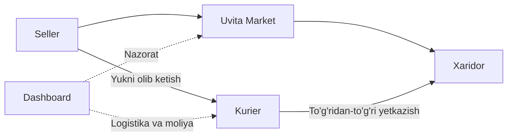
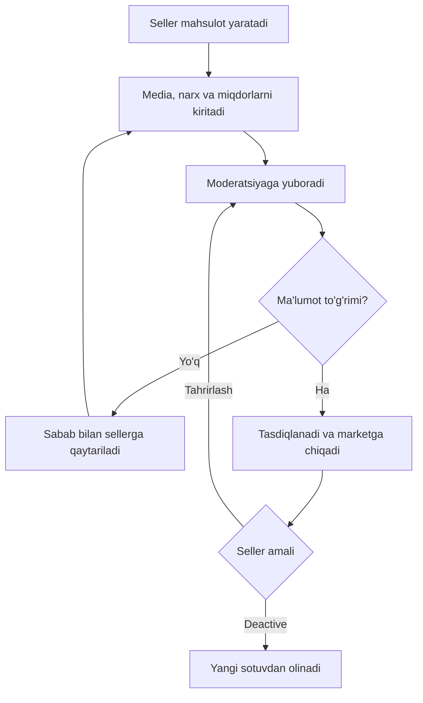
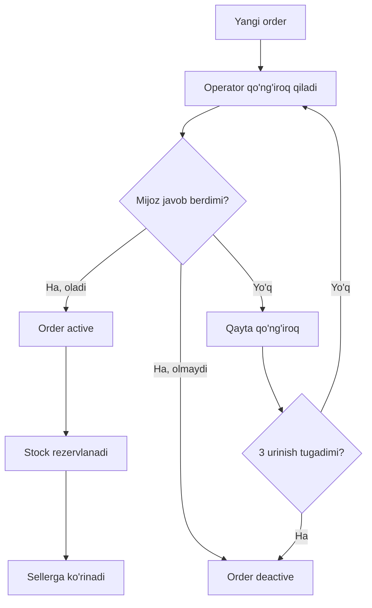
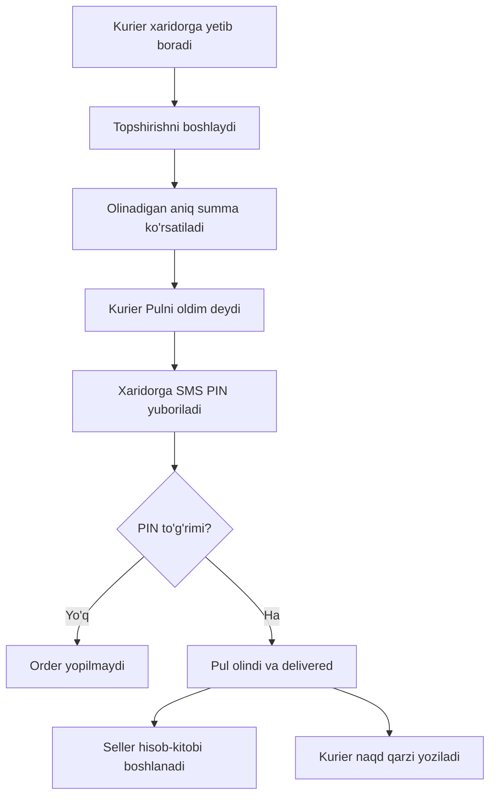
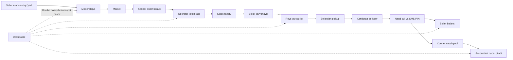

# Uvita - yagona biznes lifecycle

> Bu hujjat Uvita qanday ishlashining yagona asosiy manbasi.
> Texnik kod qoidalari `AGENTS.md`da, loyiha tuzilishi `STRUCTURE.md`da.

## 1. Uvita nima?

Uvita - ishlab chiqaruvchi, yetishtiruvchi, importchi, distributor va ulgurji
sotuvchilarni savdogar, do'kon, restoran, tashkilot va boshqa xaridorlar bilan
bog'laydigan marketplace va logistika platformasi.

Uvita mahsulotni o'z omborida saqlamaydi. Mahsulot sellerning o'z joyida turadi.
Kurier yukni sellerdan olib, to'g'ridan-to'g'ri xaridorga yetkazadi.

Kod butun O'zbekiston uchun umumiy ishlaydi. Boshlanishida faqat Dashboarddan
yoqilgan reyslar, masalan Jizzax -> Toshkent va Qashqadaryo -> Toshkent ishlaydi.

## 2. Platformaning asosiy qismlari

| Qism | Vazifasi |
|---|---|
| Market | Mahsulot ko'rish, savatcha, manzil, buyurtma va yetkazish narxi |
| Seller panel | Mahsulot, stock, order, statistika, balans va pul yechish |
| Kurier ilovasi | Reys olish, pickup, yetkazish va naqd pulni topshirish |
| Dashboard | Moderatsiya, order, logistika, moliya, xodim, setting va audit |
| Backend | Barcha biznes qoidalari va ma'lumotlarning yagona markazi |

## 3. Rollar

Boshlang'ich Dashboard rollari:

| Rol | Asosiy vazifa |
|---|---|
| Super Admin | To'liq boshqaruv, rol, permission va setting |
| Admin | Umumiy operatsion nazorat |
| Operator | Xaridorga qo'ng'iroq va orderni faollashtirish |
| Moderator | Mahsulotlarni tekshirish |
| Seller Manager | Sellerlar bilan ishlash |
| Logistics Manager | Reys, kurier va yetkazmalar |
| Accountant | Kurier naqd puli va seller pul yechishi |
| Support | Muammo va murojaatlar |

Super Admin har rol qaysi bo'limni ko'rishi va qanday amal bajarishini Dashboardda
belgilaydi. UI tugmani yashirishi yetarli emas; backend ham permissionni tekshiradi.

## 4. Seller va mahsulot

Seller ro'yxatdan o'tadi yoki xodim tomonidan ochiladi. Profil tasdiqlangach mahsulot
joylay oladi.

Mahsulotda quyidagilar bo'ladi:

- nom, kategoriya va tavsif;
- rasm va video;
- sotuv narxi va mavjud stock;
- o'lchov birligi: kg, litr, dona, quti, tonna, metr va boshqalar;
- minimal buyurtma miqdori;
- maksimal buyurtma miqdori;
- miqdor qadami, masalan 5 kg yoki 10 dona;
- og'irlik va fizik hajm;
- maxsus tashish sharti;
- sellerdan olib ketish manzili;
- mavjud bo'lsa sertifikat yoki boshqa hujjat.

Minimum, maksimum va qadamni seller belgilaydi. Tizim xavfsiz umumiy chegaralarni
setting orqali nazorat qilishi mumkin.

Qoidalar:

- minimum maksimumdan katta bo'lmaydi;
- buyurtma miqdori belgilangan qadamga mos bo'ladi;
- maksimal buyurtma sotish mumkin bo'lgan stockdan oshmaydi;
- birlikka mos kasr/butun miqdor ishlatiladi;
- og'irlik va fizik hajm logistika uchun majburiy darajada to'ldiriladi.

## 5. Mahsulot moderatsiyasi

Active mahsulot tahrirlanganda yangi variant moderatsiyaga tushadi. U tasdiqlanguncha
marketda oldingi tasdiqlangan variant ko'rinadi.

Seller mahsulotni deactive qilsa yangi order olinmaydi. Oldin active qilingan orderlar
esa oxirigacha bajariladi.

## 6. Narx va ulushlar

Seller xaridor ko'radigan mahsulot narxini kiritadi. Panel taxminiy taqsimotni ko'rsatadi:

- 10% - Uvita platforma ulushi;
- 7% - kurier uchun maksimal rezerv;
- 83% - sellerning kutiladigan sof tushumi.

Kurierning haqiqiy ulushi masofaga qarab 0.1% dan 7% gacha bo'ladi. Agar kurierga
7%dan kam hisoblangan bo'lsa, foydalanilmagan qism Uvita daromadida qoladi.

Kurier foizi Dashboardda masofa oraliqlari bo'yicha sozlanadi. Masalan, har 20 km
oralig'i uchun alohida foiz. Bu qiymatlar doimiy emas.

Xaridorga ko'rsatiladigan yetkazish narxi masofa, og'irlik, fizik hajm, transport,
qo'shimcha manzil va maxsus tashish shartidan hisoblanadi. Checkoutda mahsulot narxi,
yetkazish narxi va jami summa alohida va tushunarli ko'rsatiladi.

Har orderda ishlatilgan tarif va foizlarning snapshoti saqlanadi. Keyingi setting
o'zgarishi eski orderni qayta hisoblamaydi.

Soliq va fiskal chek modeli hozircha ochiq. Birinchi relizda real fiskal ma'lumot
yuborilmaydi; ommaviy ishga tushirishdan oldin buxgalter va huquqshunos bilan belgilanadi.

## 7. Market, savatcha va checkout

Xaridor marketda mahsulotlarni ko'radi va savatchaga qo'shadi. Seller belgilagan
minimumdan kam, maksimumdan ko'p yoki qadamga mos bo'lmagan miqdorni ololmaydi.

Checkoutda xaridor quyidagilarni beradi:

- ism;
- majburiy asosiy telefon;
- ixtiyoriy qo'shimcha telefon;
- xaritadan aniq manzil;
- yozma manzil va mo'ljal;
- kurier uchun qo'shimcha izoh.

Bitta savatchadagi turli seller mahsulotlari alohida orderlarga ajratiladi. Yaqin
yo'nalishdagi orderlar keyinchalik bitta kurier reysiga birlashtirilishi mumkin, ammo
ularning selleri, summasi, statusi va moliyaviy hisobi alohida qoladi.

Checkoutdan oldin tizim har order uchun qayta tekshiradi:

- mahsulot va seller active;
- narx o'zgarmagan;
- stock yetarli;
- min, max va step to'g'ri;
- yetkazish manzili xizmat hududida;
- yetkazish narxi va taxminiy vaqt hisoblangan.

## 8. Operator tekshiruvi

Yangi order darhol sellerga yuborilmaydi. Avval operator mijoz bilan bog'lanadi.

Har qo'ng'iroq operator, vaqt, natija va izoh bilan tarixda saqlanadi. Javob bo'lmasa
uchta majburiy urinish qilinadi. Urinish soni va oralig'i keyinchalik settingdan
o'zgartirilishi mumkin.

## 9. Stock

Stock faqat operator orderni `active` qilgan paytda transaction ichida rezervlanadi.
Parallel orderlar stockni manfiy qila olmaydi.

Order active bo'lmasa stock kamaymaydi. Active order keyin bekor/deactive qilinsa,
rezerv aynan bir marta stockka qaytariladi.

Payment webhook stockni kamaytirmaydi. Bu eski model hisoblanadi.

## 10. Seller orderni tayyorlaydi

Active order seller panelda yuqorida ko'rinadi. Seller mahsulotni buyurtmadagi miqdor
va tashish talabiga mos tayyorlaydi.

Default tayyorlash muddati 5 soat. Muddat active bo'lgan vaqtdan boshlanadi.

- Seller tayyor bo'lsa `Olib ketishga tayyor` qiladi.
- 5 soatdan oshsa order bekor bo'lmaydi.
- Sellerga eslatma yuboriladi.
- Dashboardda kechikkan order sifatida ko'rinadi.
- Keyinchalik seller SLA statistikasi uchun hodisa saqlanadi.

## 11. Yetkazma va reys

- Order - bitta sellerga tegishli xarid.
- Yetkazma - orderni sellerdan xaridorga olib borish vazifasi.
- Reys - bitta kurier bir yo'nalishda olib boradigan bir yoki bir nechta yetkazma.

Bir reysga qo'shishda quyidagilar tekshiriladi:

- masofa va asosiy yo'nalish;
- yo'nalishdan maksimal chetlashish;
- pickup va drop-off ketma-ketligi;
- kurier transportining maksimal og'irligi;
- transportning fizik hajmi;
- kurier yuradigan maksimal masofa;
- mahsulotlarning birga tashishga mosligi;
- maxsus harorat yoki boshqa shart;
- yetkazish vaqti.

Yuk kam bo'lsa reys bekor qilinmaydi. Kichikroq mos avtomobilga taklif qilinadi.

## 12. Kurier profili va reysni olish

Kurier profilida quyidagilar bo'ladi:

- telefon va asosiy shaxsiy ma'lumotlar;
- transport turi va raqami;
- maksimal yuk og'irligi;
- foydali fizik hajm;
- maksimal yurish masofasi;
- maxsus yuk imkoniyatlari;
- active va online holatlari;
- naqd qarz bo'yicha blok holati.

Kurier `Zakaz olish`ni bosganda tizim faqat profiliga va transportiga mos reyslarni
taklif qiladi. Taklifda yo'nalish, yuk, masofa, olinadigan naqd summa va taxminiy
daromad ko'rsatiladi.

Kurier reysni qabul qilganidan keyin 1 soat ichida, yukni hali sellerdan olmagan bo'lsa,
sabab bilan bekor qilishi mumkin. Keyingi oddiy so'rovda aynan shu rad qilingan taklif
unga qayta berilmaydi. Bir soatdan keyin yoki pickupdan keyin faqat Logistics Manager
aralashuvi bilan hal qilinadi.

## 13. Sellerdan yukni olish

Kurier seller manziliga boradi va quyidagilarni tekshiradi:

- mahsulot nomi va miqdori;
- brak yoki ko'rinadigan sifat muammosi;
- qadoq;
- maxsus tashish sharti;
- kerak bo'lsa foto, vaqt va GPS dalili.

Kurierga aniq ogohlantirish beriladi: yukni qabul qilishdan oldin tekshir; qabuldan
keyin tashish davridagi kamomad, buzilish yoki yo'qotish javobgarligi senda.

Yukni qabul qilgach order `yo'lda` holatiga o'tadi. Uvita omboriga olib borilmaydi.

## 14. To'liq yetkazish va naqd pul

Birinchi relizda xaridor naqd to'laydi.

PIN tasdiqlanmaguncha order delivered va pul olindi deb hisoblanmaydi. Courier summani
o'zi o'zgartirmaydi. Tasdiq aynan bir marta moliyaviy yozuv yaratadi.

Hozirgi birinchi relizda xaridor orderni 100% qabul qiladi deb olinadi. Umuman qabul
qilmaslik va oddiy return/refund keyingi alohida lifecycle bo'ladi.

## 15. Qisman yetkazish

Mahsulot buyurtmadagidan kam borgan bo'lsa courier qisman yetkazishni tanlaydi:

1. har mahsulotning haqiqiy miqdorini kiritadi;
2. sabab va dalolatnoma yozadi;
3. rasm, video yoki fayl dalilini yuklaydi;
4. haqiqiy summa qayta hisoblanadi;
5. sellerga notification yuboriladi;
6. seller 4 soat ichida approve yoki reject qiladi.

Seller approve qilsa qisman yetkazish haqiqiy miqdor bo'yicha yakunlanadi. Seller rad
etsa yoki 4 soat javob bermasa avtomatik approve bo'lmaydi; Dashboarddagi mas'ul xodim
tekshiradi.

## 16. Seller balansi

Delivery PIN tasdiqlangan paytdan seller hisob-kitobi boshlanadi:

Seller quyidagilarni ko'radi:

- jami savdo;
- processing summa;
- pending summa;
- yechishga tayyor balans;
- platforma va kurier ushlanmalari;
- arizalar va tranzaksiyalar.

Pul yechish arizasida seller nomi, telefon va saqlangan to'lov rekviziti avtomatik
olinadi. Seller faqat yechishga tayyor balansdan oshmaydigan summa va ixtiyoriy izoh
kiritsa bo'ladi.

Ariza yuborilganda summa hold qilinadi. Accountant approve/paid yoki reject qiladi.
Reject bo'lsa hold yechiladi. Kim qaror qilgani auditga yoziladi. Ariza topshirish uchun
alohida muddat cheklovi yo'q.

## 17. Kurier daromadi va naqd qarzi

Kurier daromadi yetkazilgan mahsulot qiymati va masofa bandiga mos foizdan hisoblanadi.
Masofa bandlari Dashboard settingida turadi va har orderda snapshot qilinadi.

Kurier mijozdan olgan barcha naqd pul bo'yicha Uvita oldida qarzdor bo'ladi.

Reys tugagach:

1. courier pul topshirish so'rovini yuboradi;
2. Dashboardda uning ismi, telefoni, reysi, kutilgan summa va topshirayotgan summasi chiqadi;
3. Accountant real olingan summani tasdiqlaydi;
4. tasdiqdan keyingina courier qarzi kamayadi.

Yangi reys olish uchun courier tegishli summaning kamida 90%ini topshirgan bo'lishi kerak.
90%dan kam bo'lsa yangi reys bloklanadi. Qolgan qarzni yopish uchun 3 kun beriladi.
3 kun o'tsa qarz to'liq yopilmaguncha courier blokda qoladi va Dashboardda alert chiqadi.

## 18. Dashboard nazorati

Dashboardda quyidagilar bo'ladi:

- sellerlar va ularning holati;
- mahsulot moderatsiyasi;
- orderlar, qo'ng'iroq va qayta qo'ng'iroqlar;
- 5 soatdan oshgan tayyorlashlar;
- reys, active trip va kechikishlar;
- courier, transport va capacity;
- courier naqd qarzi va pul topshirish;
- seller balans va withdrawal;
- qisman yetkazish dalolatnomalari;
- xodimlar, role va permission;
- settinglar;
- audit;
- umumiy analitika va alertlar.

## 19. Sozlanadigan qoidalar

Quyidagilar kodga qotirilmaydi:

- active hudud va reyslar;
- reys kunlari va vaqti;
- pickup/drop-off radiusi;
- maksimal detour;
- yetkazish tariflari va ETA bandlari;
- seller tayyorlash muddati, default 5 soat;
- operator urinish soni va oralig'i, default 3 urinish;
- partial approval muddati, default 4 soat;
- seller processing muddati, default 2 soat;
- seller withdrawable muddati, default delivered'dan 48 soat;
- platforma ulushi, default 10%;
- kurier maksimal rezervi, default 7%;
- kurier distance bandlari, 0.1%-7%;
- courier unblock chegarasi, default 90%;
- qolgan qarz muddati, default 3 kun;
- umumiy min/max/step xavfsizlik chegaralari.

Setting o'zgarganda eski order va reys tarixiy snapshotini saqlaydi.

## 20. Notification va audit

Muhim xabarlar queue orqali yuboriladi. Provider ishlamasa asosiy transaction yo'qolmaydi.

Notification kerak bo'lgan asosiy holatlar:

- OTP va delivery PIN;
- product approve/reject;
- order active;
- seller deadline eslatmasi va overdue;
- ready for pickup va courier offer;
- trip accept/cancel;
- partial delivery seller qarori va escalation;
- seller balans bosqichlari va withdrawal;
- courier 90%/3 kun qarz alerti;
- accountantga cash handover request.

Barcha muhim admin, seller va courier amallari auditda actor, amal, entity, vaqt va
xavfsiz old/new diff bilan saqlanadi. Password, token, OTP/PIN va boshqa secret auditga
yozilmaydi.

## 21. Canonical biznes holatlar

Texnik enum nomlari migratsiya davomida farq qilishi mumkin, ammo biznes ma'nosi bitta:

| Obyekt | Asosiy holatlar |
|---|---|
| Product | draft, moderation, active, rejected, deactive |
| Order | operator_review, callback_required, active, preparing, ready_for_pickup, assigned, in_transit, partial_review, delivered, deactive/cancelled |
| Trip offer | offered, accepted, rejected/expired, cancelled |
| Withdrawal | requested, held, approved, paid, rejected |
| Cash handover | requested, accepted, rejected/reconciled |
| Partial case | submitted, seller_approved, seller_rejected, manual_review, resolved |

Har status o'tishi backendda tekshiriladi va tarixda saqlanadi. UI statusni o'zicha
o'zgartirmaydi.

## 22. Hozircha ochiq masalalar

Quyidagilar birinchi implementatsiyani bloklamaydi, lekin productiondan oldin yoki keyingi
relizda alohida tasdiqlanadi:

- soliq va fiskal chek kim nomidan berilishi;
- online payment;
- xaridor butunlay qabul qilmasa return/refund;
- sifat nizosi va seller javobi;
- sertifikat va yaroqlilik muddati;
- sug'urta va murakkab zarar undirish;
- qisman yetkazishning kengaytirilgan dispute qoidalari.

Bu ochiq masalalar uchun kodga noto'g'ri qat'iy formula yozilmaydi; adapter va setting
orqali keyin kengaytirish imkoniyati saqlanadi.

## 23. Umumiy yakuniy oqim

Qisqa xulosa: Uvita mahsulotni omborga olmaydi. Platforma seller, xaridor va courierni
bog'laydi; mahsulotni moderatsiya qiladi, orderni tekshiradi, stockni rezervlaydi, mos
reysga beradi, to'g'ridan-to'g'ri yetkazishni va naqd hisob-kitobni nazorat qiladi.
